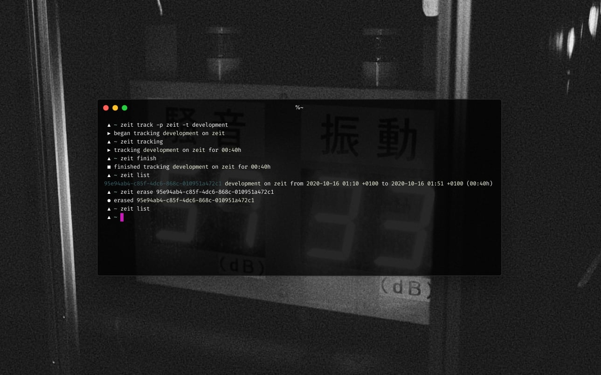
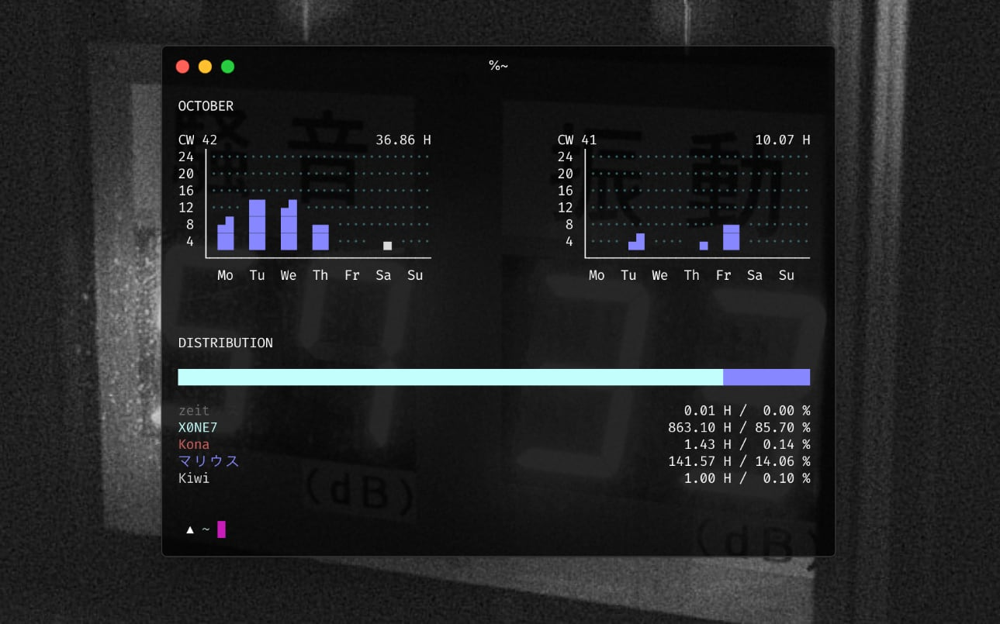
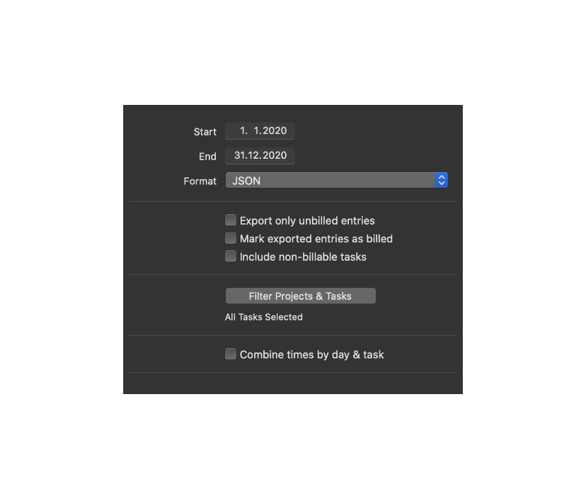

-------------------------------

Zeit, erfassen. A command line tool for tracking time spent on tasks & projects.

[Get some more info on why I build this here](https://マリウス.com/zeit-erfassen-a-cli-activity-time-tracker/).

[Download the latest version for macOS, Linux, FreeBSD, NetBSD, OpenBSD & Plan9 here](https://github.com/mrusme/zeit/releases/latest).


## Build

```sh
make
```

**Info**: This will build using the version 0.0.0. You can prefix the `make` 
command with `VERSION=x.y.z` and set `x`, `y` and `z` accordingly if you want 
the version in `zeit --help` to be a different one.


## Usage



Please make sure to `export ZEIT_DB=~/.config/zeit.db` (or whatever location 
you would like to have the zeit database at).

*zeit*'s data structure contains of the following key entities: `project`, 
`task` and `entry`. An `entry` consists of a `project` and a `task`. These
don't have to pre-exist and can be created on-the-fly inside a new `entry` using
e.g. `zeit track --project "New Project" --task "New Task"`. In order to
configure them, the `zeit project` and the `zeit task` commands can be utilised.


### Projects

A project can be configured using `zeit project`:

```sh
zeit project --help
```

#### Examples:

Set the project color to a hex color code, allowing `zeit stats` to display
information in that color (if your terminal supports colours):

```sh
zeit project --color '#d3d3d3' "cool project"
```


### Task

A task can be configured using `zeit task`:

```sh
zeit task --help
```

#### Examples:

Setting up a Git repository to have commit messages automatically imported
into the activity notes when an activity is finished:

```sh
zeit task --git ~/my/git/repository "development"
```

**Info:** You will have to have the `git` binary available in your `PATH` for 
this to work. *zeit* automatically limits the commit log to the exact time of 
the activity's beginning- and finish-time. Commit messages before or after these 
times won't be imported.


### Track activity

```sh
zeit track --help
```

#### Examples:

Begin tracking a new activity and reset the start time to 15 minutes ago:

```sh
zeit track --project project --task task --begin -0:15
```


### Show current activity

```sh
zeit tracking
```


### Finish tracking activity

```sh
zeit finish --help
```

#### Examples:

Finish tracking the currently tracked activity without adding any further info:

```sh
zeit finish
```

Finish tracking the currently tracked activity and change its task:

```sh
zeit finish --task other-task
```

Finish tracking the currently tracked activity and adjust its start time to 
4 PM:

```sh
zeit finish --begin 16:00
```


### List tracked activity

```sh
zeit list --help
```

#### Examples:

List all tracked activities:

```sh
zeit list
```

List all tracked activities since a specific date/time:

```sh
zeit list --since "2020-10-14T00:00:01+01:00"
```

List all tracked activities and add the total hours:

```sh
zeit list --total
```

List only projects and tasks (relational):

```sh
zeit list --only-projects-and-tasks
```

List only projects and tasks (relational) that were tracked since a specific 
date/time:

```sh
zeit list --only-projects-and-tasks --since "2020-10-14T00:00:01+01:00"
```


### Display/update activity

```sh
zeit entry --help
```

#### Examples:

Display a tracked activity:

```sh
zeit entry 14037730-5c2d-44ff-b70e-81f1dcd4eb5f
```

Update a tracked activity:

```sh
zeit entry --finish "2020-09-02T18:16:00+01:00" 14037730-5c2d-44ff-b70e-81f1dcd4eb5f
```


### Erase tracked activity

```sh
zeit erase --help
```

#### Examples:

Erase a tracked activity by its internal ID:

```sh
zeit erase 14037730-5c2d-44ff-b70e-81f1dcd4eb5f
```


### Statistics



```sh
zeit stats
```


### Import tracked activities

```sh
zeit import --help
```

The following formats are supported as of right now:

#### `tyme`: Tyme 3 JSON

It is possible to import JSON exports from [Tyme 3](https://www.tyme-app.com). 
It is important that the JSON is exported with the following options set/unset:



- `Start`/`End` can be set as required
- `Format` has to be `JSON`
- `Export only unbilled entries` can be set as required
- `Mark exported entries as billed` can be set as required
- `Include non-billable tasks` can be set as required
- `Filter Projects & Tasks` can be set as required
- `Combine times by day & task` **must** be unchecked

During import, *zeit* will create SHA1 sums for every Tyme 3 entry, which 
allows it to identify every imported activity. This way *zeit* won't import the 
exact same entry twice. Keep this in mind if you change entries in Tyme and 
then import them again into *zeit*.

#### Examples:

Import a Tyme 3 JSON export:

```sh
zeit import --format tyme ./tyme.export.json
```


### Export tracked activities

```sh
zeit export --help
```

The following formats are supported as of right now:

#### `zeit`: *zeit* JSON

The *zeit* internal JSON format. Basically a dump of the database including
only tracked activities.

#### `tyme`: Tyme 3 JSON

It is possible to export JSON compatible to the Tyme 3 JSON format. Fields that
are not available in *zeit* will be filled with dummy values, e.g.
`Billing: "UNBILLED"`.

#### Examples:

Export a Tyme 3 JSON:

```sh
zeit export --format tyme --project "my project" --since "2020-04-01T15:04:05+07:00" --until "2020-04-04T15:04:05+07:00"
```

### Quality of life aliases 
All tested in `zsh` under `macOS Monterey Version 12.4` for a single task. An example of the time formats is as follows: `1994-11-05T08:15:30-05:00 corresponds to November 5, 1994, 8:15:30 am, US Eastern Standard Time.` 

#### Examples:

Getting running totals (includes the currently running task time):

`alias zlist-all="zeit list"`

Today: 
```
alias zlist-tday="zlist-all --since "$(date +%F)T00:00:00+12:00" --total"
```

Current week: 
```
alias zlist-cweek="zlist-all --since "$(date -v -Mon +%F)T00:00:00+12:00" --total | grep TOTAL:"
``` 

Current month (coincides with total under `zeit stats`): 
```
alias zlist-cmonth="zlist-all --since "$(date +%Y-%m-01)T00:00:00+12:00" --total | grep TOTAL:"
``` 

Pausing the current task retroactively, e.g., after getting back from lunch. Replace `YOUR_PROJECT` and `YOUR_TASK` appropriately. 
```
function zbreak {
  date -v-$1M +%H:%M | xargs -I{} zeit finish -s {}
  zeit track --project YOUR_PROJECT --task YOUR_TASK
}
```

## Integrations

Here are a few integrations and extensions built by myself as well as other 
people that make use of `zeit`:

- [`zeit-waybar-wofi.sh`](https://github.com/mrusme/zeit/blob/main/extras/zeit-waybar-wofi.sh), 
  a script for integrating `zeit` into waybar, using wofi
- [`zeit.1m.sh`](https://github.com/mrusme/zeit/blob/main/extras/zeit.1m.sh), 
  an [`xbar`](https://github.com/matryer/xbar) plugin for `zeit`
- [`zeit-status.sh`](https://github.com/khughitt/dotfiles/blob/master/polybar/scripts/zeit-status.sh), 
  a [Polybar](https://github.com/polybar/polybar) integration for `zeit` by 
  [@khughitt](https://github.com/khughitt) 
  (see [#1](https://github.com/mrusme/zeit/issues/1))
- your link here, feel free to PR! :-)
